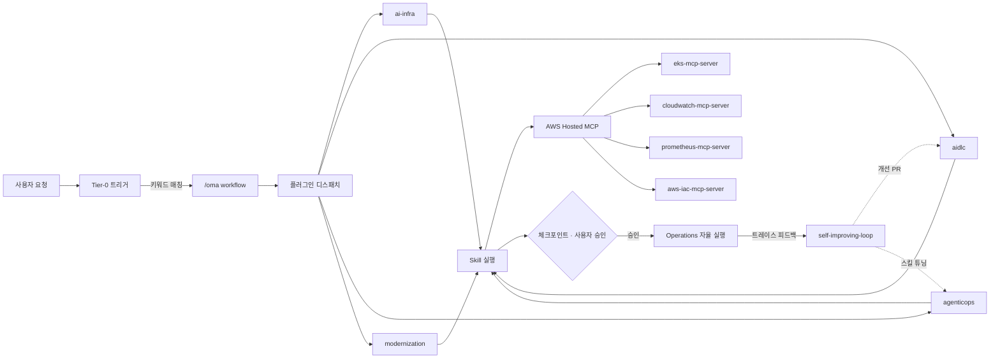

# oh-my-aidlcops (OMA)

> **"AIDLC 는 신뢰할 수 있을 때 비로소 에이전트에게 맡길 수 있다. 온톨로지가 정확성을, 하네스가 안전성을 보장한다."**

`oh-my-aidlcops`(OMA)는 [AIDLC 방법론](https://devfloor9.github.io/engineering-playbook/docs/aidlc/methodology)의 두 신뢰성 축 — **온톨로지 엔지니어링**(정확성)과 **하네스 엔지니어링**(안전성) — 을 AWS 위에서 설치 가능한 플러그인으로 구현한 **Claude Code · Kiro 플러그인 마켓플레이스** 입니다. AWS 공식 AIDLC Workflows 가 프로세스 척추 역할을 하고, AgenticOps 가 운영 신호를 온톨로지로 되돌려 루프를 닫습니다. 리포지토리 — [aws-samples/sample-oh-my-aidlcops](https://github.com/aws-samples/sample-oh-my-aidlcops).

---

## 1. 왜 OMA 인가 — 문제 정의

AWS 공식 [awslabs/aidlc-workflows](https://github.com/awslabs/aidlc-workflows) 는 AI 주도 개발 수명주기를 세 단계(Inception → Construction → Operations)로 구조화합니다. 그러나 [AIDLC 방법론](https://devfloor9.github.io/engineering-playbook/docs/aidlc/methodology)이 지적하듯, 에이전틱 AIDLC 의 실패는 **모델 역량이 아니라 신뢰성**에서 발생합니다.

- **할루시네이션·드리프트** — 개념이 프롬프트·세션마다 다른 의미를 가져, 핸드오프가 사람의 재해석에 의존합니다. (`autopilot-deploy` 와 `construction-loop` 이 "deployment target" 을 서로 다르게 쓰던 실제 사례 → [Ontology](./ontology.md) 참조)
- **런어웨이 실행** — 아키텍처적 제약이 없으면 에이전트 루프가 수백 회 재시도를 발사합니다(방법론의 핀테크 사례: 847회 재시도, 약 $2,200, 3시간 장애).
- **셀프 채점** — 코드를 작성한 에이전트가 테스트도 작성하면 자신의 사각지대가 검증을 통과합니다.

이 세 가지는 단계 스킵·미완결 운영 구간과 결합해 라이프사이클을 구조적으로 취약하게 만듭니다.

---

## 2. OMA 의 접근 방식 — 신뢰성 2축 + 프로세스 척추

OMA 는 방법론의 **신뢰성 2축**을 설치 가능한 형태로 구현하고, 그 위에 AIDLC Workflows(프로세스)와 AgenticOps(피드백)를 곁들입니다.

> **이지버튼 원칙** — 두 축을 직접 구축하지 않습니다. 마켓플레이스를 추가하고 플러그인을 설치하면 typed 온톨로지·하네스 DSL·AWS Hosted MCP 배선이 곧바로 활성화됩니다. 스키마·정책·훅을 손으로 짤 필요가 없는 것이 핵심 가치입니다.

### ① 온톨로지 엔지니어링 — 정확성 (WHAT · WHEN)

"프롬프트 엔지니어링은 온톨로지 엔지니어링이다." OMA 는 모든 플러그인·스킬이 합의하는 **8 개 JSON-Schema 엔티티**(`schemas/ontology/`)로 도메인을 typed world model 로 고정합니다. 핸드오프는 산문이 아니라 검증된 온톨로지 문서(`Deployment`, `Spec`, `ADR` …)로 전달되고, `oma validate` 가 스키마·정책 위반을 기계적으로 잡습니다. 상세: [Ontology Engineering](./ontology-engineering.md).

### ② 하네스 엔지니어링 — 안전성 (HOW)

"에이전트가 어려운 게 아니라 하네스가 어렵다." OMA 는 에이전트 실행을 아키텍처적으로 제약합니다 — **하네스 DSL v2**(`policies`/OPA, `telemetry`), `oma compile --strict-enterprise` 게이트, MCP 버전 pin, 샌드박싱된 budget 평가. 런어웨이·셀프채점을 retry budget·cost limit·독립 검증으로 차단합니다. 상세: [Harness Engineering](./harness-engineering.md).

### ③ AIDLC Workflows + AgenticOps Outer Loop

**AIDLC Workflows** 가 Inception → Construction → Operations 프로세스 척추를 제공하고, **AgenticOps** 가 운영 신호(트레이스·메트릭·인시던트)를 온톨로지로 되돌리는 **Outer Loop**(살아있는 온톨로지)를 닫습니다. 사람은 Tier-0 체크포인트에서 **승인**하고, 진단·제안·실행은 에이전트가 담당합니다 — "누가 실행했는가" 가 아니라 "어떤 정책 하에 승인되었는가" 로 거버넌스 단위가 이동합니다.

> **한 커맨드, 전체 라이프사이클** — `/oma:autopilot` 한 번으로 세 단계가 순차 실행되며 명시적 승인 게이트에서만 멈춥니다. 트레이스 기반 자가 개선(`/oma:self-improving`)은 회귀 테스트가 통과해야 PR 을 엽니다.

---

## 3. 작동 방식 — 메커니즘



Operations 단계의 관측 데이터(Langfuse 트레이스, Prometheus 메트릭, CloudWatch 로그)가 `self-improving-loop` 로 역류해 Construction 스킬·프롬프트의 **자동 개선 PR** 을 만듭니다. 이 역방향 피드백이 이전에는 인간의 이슈 분류와 백로그 관리에 의존하던 경로입니다. 단, trace 기반 피드백은 외부 Langfuse 인스턴스와 trace MCP 서버가 프로파일(`observability.trace_mcp`)에 구성되어야 동작합니다.

더 자세한 설계 명제와 거버넌스 철학은 [Philosophy — AIDLC meets AgenticOps](./philosophy-aidlc-meets-agenticops.md) 를 참조합니다.

### 지향점 — 엔터프라이즈 운영 자동화 오픈 툴셋

OMA 는 신뢰성 2축을 기반으로 **엔터프라이즈 운영 자동화 오픈 툴셋**으로 확장됩니다.

1. **현재** — 온톨로지 + 하네스 엔지니어링을 설치 가능한 플러그인으로 제공하고, AWS Hosted MCP(awslabs/mcp)를 기본 런타임 데이터 평면으로 사용하며, AgenticOps 가 Outer Loop 를 닫습니다.
2. **다음** — AWS Hosted MCP 커버리지 확대와 함께 **DevOps 에이전트**·**Security 에이전트** 를 일급으로 통합해, 배포·관측·보안 리뷰를 동일한 Tier-0 승인 모델 안에서 거버넌스된 에이전트로 실행합니다.
3. **약속** — 몇 개의 플러그인 설치만으로 감사 가능하고 정책 게이트가 걸리며 하네스로 제약된 엔터프라이즈급 운영 자동화를 기본값으로 제공합니다 — 직접 조립하는 맞춤형 플랫폼이 아니라 드롭인 오픈 툴셋입니다.

---

## 4. 플러그인 카탈로그 (4개)

OMA 마켓플레이스는 **네 개의 플러그인** 으로 구성됩니다. 각 플러그인의 역할은 서로 직교하거나 순차적입니다 — 원하는 것만 선택해 설치할 수 있습니다.

| 플러그인 | 언제 쓰나요? | 주요 스킬 | 위치 |
|---|---|---|---|
| **`ai-infra`** | EKS/Bedrock/SageMaker 위에서 agentic AI 런타임을 구축·운영할 때 | `agentic-eks-bootstrap`, `vllm-serving-setup`, `inference-gateway-routing`, `langfuse-observability`, `gpu-resource-management`, `ai-gateway-guardrails` | AIDLC 3단계와 **직교하는 런타임 레이어** |
| **`aidlc`** | 스펙 → 설계 → 구현 파이프라인을 한 플러그인 안에서 돌리고 싶을 때. Inception 산출물이 Construction 입력으로 직접 전달됩니다. | inception: `workspace-detection`, `requirements-analysis`, `user-stories`, `workflow-planning` / construction: `component-design`, `code-generation`, `test-strategy`, `risk-discovery`, `quality-gates` | AIDLC **Phase 1 + Phase 2** |
| **`agenticops`** | 배포된 에이전틱 워크로드의 Day-2 운영을 에이전트에게 위임하고 싶을 때 | `self-improving-loop`, `autopilot-deploy`, `incident-response`, `continuous-eval`, `cost-governance`, `audit-trail` | AIDLC **Phase 3 (Operations)** |
| **`modernization`** | 브라운필드 레거시 워크로드를 6R 전략으로 AWS 로 옮길 때. 6단계 워크플로우가 Construction 입력을 만들어냅니다. | `workload-assessment`, `modernization-strategy` (6R), `to-be-architecture`, `containerization`, `cutover-planning` | AIDLC **브라운필드 진입 경로** |

### 플러그인 경계의 직관

- **`aidlc`** 가 AIDLC 의 **프로세스 축**(Phase 1 + Phase 2)을 담당하고,
- **`agenticops`** 가 **Phase 3(Operations)** 과 피드백 루프를 담당합니다.
- **`ai-infra`** 는 이 루프가 돌 **런타임 기반** (EKS 클러스터, 추론 게이트웨이, 관측 스택) 을 제공합니다 — AIDLC 3단계와 **직교** 합니다.
- **`modernization`** 은 AIDLC 로 진입할 때의 **브라운필드 갈래** 입니다. 6R 의사결정과 cutover 계획이 Construction 의 입력으로 공급됩니다.

플러그인 상세 정의는 [`.claude-plugin/marketplace.json`](https://github.com/aws-samples/sample-oh-my-aidlcops/blob/main/.claude-plugin/marketplace.json) 에 있습니다.

---

## 5. Tier-0 워크플로우 (9개)

Tier-0 는 "한 번 호출하면 체크포인트에서만 승인을 받고 자율 실행하는" 고레버리지 워크플로우입니다. 커맨드를 외우지 않아도 키워드 매칭으로 자동 제안됩니다.

| 커맨드 | 목적 | 체크포인트 수 |
|---|---|---|
| `/oma:autopilot` | AIDLC 전체 루프 자율 실행 (Inception → Construction → Operations) | 4~6 |
| `/oma:aidlc-loop` | 단일 feature AIDLC 1회전 (Inception → Construction) | 2~3 |
| `/oma:inception` | AIDLC Phase 1 단독 실행 | 1~2 |
| `/oma:construction` | AIDLC Phase 2 단독 실행 | 2~3 |
| `/oma:agenticops` | 운영 모드 활성화 (continuous-eval + incident-response + cost-governance 상시 구동) | 1 |
| `/oma:self-improving` | Langfuse 트레이스 → skill·prompt 개선 PR 피드백 루프 | 2 |
| `/oma:platform-bootstrap` | EKS 위 Agentic AI Platform 5단계 체크포인트 구축 | 5 |
| `/oma:modernize` | 레거시 워크로드 6R 모더나이제이션 (6단계) | 6 |
| `/oma:cancel` | 활성 Tier-0 모드 종료 | 0 |

각 커맨드의 상세 호출 방식·체크포인트 구조·MCP 의존성은 [Tier-0 Workflows](./tier-0-workflows.md) 에서 다루고, 자연어 트리거는 [Keyword Triggers](./keyword-triggers.md) 를 참조합니다.

---

## 6. Dual Harness

OMA 는 두 가지 에이전트 하네스에서 동일하게 동작합니다.

- **Claude Code** — 네이티브 `/plugin marketplace add` 로 설치. `.claude/plugins/`, `.claude/commands/oma/`, `.claude/settings.json` 에 통합됩니다. 상세: [Claude Code Setup](./claude-code-setup.md).
- **Kiro** — `bash scripts/install/kiro.sh` 로 설치. `~/.kiro/skills/` 에 스킬을 심링크하고, `.kiro/agents/` 에 에이전트 프로필을 설치합니다. aidlc 플러그인은 `skills/inception/` 과 `skills/construction/` 그룹을 자동으로 전개합니다. 상세: [Kiro Setup](./kiro-setup.md).
- **공유 상태** — 프로젝트 루트의 `.omao/` 디렉터리는 harness-agnostic 합니다. 두 하네스 모두 같은 파일을 읽고 씁니다 — Kiro 에서 시작한 AIDLC 루프를 Claude Code 에서 이어받을 수 있습니다.
- **권장 경로** — `oma setup` 하나로 프로파일 + 씨드 온톨로지 + 플러그인 설치까지 한 번에. 상세: [Easy Button](./easy-button.md).

---

## 7. 30초 설치

```bash
claude
```

Claude Code 세션 안에서:

```text
/plugin marketplace add https://github.com/aws-samples/sample-oh-my-aidlcops
/plugin install ai-infra@oh-my-aidlcops
/plugin install agenticops@oh-my-aidlcops
/plugin install aidlc@oh-my-aidlcops
/plugin install modernization@oh-my-aidlcops
/plugin list
```

`/plugin list` 결과에 4 개 플러그인이 모두 `enabled` 로 보이면 성공입니다. 첫 Tier-0 실행은 `/oma:aidlc-loop` 로 시도하는 것이 안전합니다.

설치 경로 3 가지(remote one-liner / 네이티브 마켓플레이스 / 수동 스크립트)의 정확한 역할 비교는 [Getting Started](./getting-started.md) 를, Kiro 환경은 [Kiro Setup](./kiro-setup.md) 을 참조합니다.

---

## 8. 재사용 자산

OMA 는 재발명 대신 재사용을 원칙으로 합니다. 전체 attribution 은 [NOTICE](https://github.com/aws-samples/sample-oh-my-aidlcops/blob/main/NOTICE) 에, 외부 스펙·프레임워크·런타임 도구 전체 카탈로그는 [REFERENCES.md](https://github.com/aws-samples/sample-oh-my-aidlcops/blob/main/REFERENCES.md) 에 정리되어 있습니다.

| 출처 | 라이선스 | 활용 방식 |
|---|---|---|
| [awslabs/agent-plugins](https://github.com/awslabs/agent-plugins) | Apache-2.0 | Plugin · Skill · MCP · Marketplace JSON 스키마 채택 |
| [awslabs/aidlc-workflows](https://github.com/awslabs/aidlc-workflows) | MIT-0 | AIDLC core 사용. OMA 는 `*.opt-in.md` 확장만 기여 |
| [awslabs/mcp](https://github.com/awslabs/mcp) | Apache-2.0 | 11 개 hosted MCP 서버 참조 |
| [aws-samples/sample-apex-skills](https://github.com/aws-samples/sample-apex-skills) | MIT-0 | 5-체크포인트 워크플로우 템플릿 |
| [aws-samples/sample-ai-driven-modernization-with-kiro](https://github.com/aws-samples/sample-ai-driven-modernization-with-kiro) | MIT-0 | risk-discovery, audit-trail, quality-gates, 6R 전략 방법론 |
| [oh-my-claudecode](https://github.com/Yeachan-Heo/oh-my-claudecode) | — | Tier-0 오케스트레이션 철학 계승 |

---

## 9. 다음 단계

1. [Getting Started](./getting-started.md) — 5분 Quickstart 로 첫 Tier-0 실행 경험
2. [Ontology Engineering](./ontology-engineering.md) · [Harness Engineering](./harness-engineering.md) — 신뢰성 2축의 방법론 매핑
3. [Philosophy](./philosophy-aidlc-meets-agenticops.md) — AIDLC × AgenticOps 의 설계 명제와 거버넌스 프레이밍
3. [Claude Code Setup](./claude-code-setup.md) 또는 [Kiro Setup](./kiro-setup.md) — 실제 설치 진행
4. [Tier-0 Workflows](./tier-0-workflows.md) — 9 개 커맨드의 상세 레퍼런스
5. [Enterprise Readiness](./enterprise-readiness.md) — `--strict-enterprise` 게이트와 8-probe 검증

---

## 참고 자료

### 공식 문서
- [awslabs/aidlc-workflows](https://github.com/awslabs/aidlc-workflows) — AIDLC core workflow 공식 저장소
- [awslabs/agent-plugins](https://github.com/awslabs/agent-plugins) — plugin · skill · marketplace 표준
- [awslabs/mcp](https://github.com/awslabs/mcp) — AWS Hosted MCP 서버 모음

### 관련 프로젝트
- [oh-my-claudecode](https://github.com/Yeachan-Heo/oh-my-claudecode) — 범용 Claude Code 오케스트레이션 (OMA 의 모체)
- [oh-my-aidlcops 리포지터리](https://github.com/aws-samples/sample-oh-my-aidlcops) — 소스 코드 · 이슈 트래커

### OMA 내부 문서
- [Getting Started](./getting-started.md) — 5분 Quickstart
- [Tier-0 Workflows](./tier-0-workflows.md) — 전체 커맨드 레퍼런스
- [Keyword Triggers](./keyword-triggers.md) — 키워드 기반 자동 커맨드 호출
- [Ontology](./ontology.md) — 8 개 공유 스키마 (Agent, Skill, Deployment, Incident, Budget, Risk, Spec, ADR)
- [Harness DSL](./harness-dsl.md) · [Harness DSL v2](./harness-dsl-v2.md) — 플러그인 DSL 과 컴파일 파이프라인
