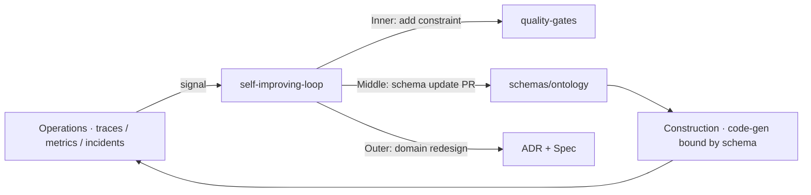

# Ontology Engineering — the correctness axis

> "Prompt engineering is ontology engineering."

The [AIDLC methodology](https://devfloor9.github.io/engineering-playbook/docs/aidlc/methodology)
frames reliability as a **dual-axis**: Ontology Engineering guarantees the
**correctness** of what agents produce (the WHAT and WHEN), and
[Harness Engineering](./harness-engineering.md) enforces the **safety** of how
they execute (the HOW). This page covers the first axis and how OMA implements it.

The companion page [Ontology](./ontology.md) is the *schema reference* — the
literal entities and fields. This page is the *why*: how those schemas realize the
methodology's correctness guarantees.

## The failures ontology prevents

Agentic systems fail on correctness in three recurring ways — none about model
quality:

| Failure | Without ontology | With ontology |
|---|---|---|
| **Hallucination** | The agent invents plausible-but-wrong domain reasoning. | Every domain concept is explicitly defined; invariants are encoded and violations are caught mechanically. |
| **Context loss** | Definitions scattered across prompts; the agent loses the thread mid-session. | One typed world model is the single referent across prompts, sessions, and tools. |
| **Inconsistency / drift** | A term means different things in different skills, so handoffs need a human to re-interpret. | A handoff is a *validated document*, not prose. |

OMA's concrete origin story: `autopilot-deploy` and `construction-loop` both said
"deployment target" — one meant an EKS cluster name, the other meant the enum
`eks | ec2 | lambda`. The handoff only worked because a human re-read it. The
`Deployment` entity closes that gap.

## The typed world model

The methodology elevates DDD's *Ubiquitous Language* from informal natural-language
consensus into a **formal, machine-readable schema** — a "typed world model" scoped
to AI agents + team + code, validated automatically rather than by manual review.
Its four characteristics: **formality, type safety, verifiability, evolvability**.

OMA realizes this as **8 JSON-Schema entities** (Draft 2020-12) in
`schemas/ontology/`:

| Entity | Role in the correctness chain |
|---|---|
| `Spec`, `ADR` | Inception intent and decisions — the source of WHAT/WHEN |
| `Agent`, `Skill` | The actors and their declared produce/consume contracts |
| `Deployment` | The validated Construction→Operations handoff document |
| `Incident`, `Budget`, `Risk` | Operations-side facts that feed the Outer Loop |

`oma validate <entity.yaml>` enforces the JSON Schema on all 8 — the mechanical
"violation detection" the methodology calls for. See [Ontology](./ontology.md) for
field-level detail.

This validation is **post-hoc**: it catches a wrong artifact after it is
written. The proposed [Knowledge Wiki](./knowledge-wiki.md) is the complementary
*pre-generation* retrieval layer — it grounds an agent in what the domain
already defines *before* it produces an entity, so drift is prevented at the
source rather than caught at the handoff.

## The triple feedback loop — a living ontology

The methodology's key insight is that an ontology is not written once; it is
*alive*, refined by three nested loops at different cadences:

| Loop | Cycle | Trigger | Ontology change | OMA surface |
|---|---|---|---|---|
| **Inner** | minutes | test failure, harness violation | add/modify a constraint | `quality-gates`, schema-evolution rule 1 (add fields first) |
| **Middle** | days | repeated PR-review patterns | update entity/relationship schema | DSL `version:` bump on breaking changes |
| **Outer** | weeks | operational incidents, SLO violations | redesign domain model structure | `agenticops` → `self-improving-loop` |

The methodology's worked example: rising P99 latency drives a redesign of an
overgrown `Payment` aggregate (which carried full customer history) into a
`CustomerReference` plus a separate `CustomerProfile` aggregate — reportedly
cutting P99 by 42%. The redesign is an *ontology* change, triggered by *operations*.

## AgenticOps as the Outer Loop

This is where OMA's operations story re-enters as a methodology citizen rather than
a standalone feature. **AgenticOps is the Outer Loop made autonomous** — it feeds
observability data (Langfuse traces, Prometheus metrics, incident postmortems) back
into the ontology, which the methodology summarizes as **"AIOps → AIDLC."**

In OMA, `self-improving-loop` analyzes trace patterns and proposes concrete
skill/prompt PRs (non-destructive, regression tests required before the PR opens),
so the Operations→Construction arrow — historically dependent on human issue triage
— is automated. The reported methodology gains from closing this loop: accuracy
+31%, false positives −67%, error rate 8.3% → 1.2% over 31 days, versus negligible
improvement (8.3% → 7.9%) without the loop.

## Where the harness plugs in

Ontology owns **WHAT + WHEN** — it *defines* the constraints. It does not *enforce*
them at execution time. That is the harness's job (the HOW axis): the harness
verifies the constraints the ontology declares and feeds verification results back
into ontology evolution. Continue to [Harness Engineering](./harness-engineering.md).

## References

- [engineering-playbook — Ontology Engineering](https://devfloor9.github.io/engineering-playbook/docs/aidlc/methodology/ontology-engineering) — conceptual source ([REFERENCES](https://github.com/aws-samples/sample-oh-my-aidlcops/blob/main/REFERENCES.md#ep-ontology-engineering))
- [Ontology](./ontology.md) — OMA's 8-entity schema reference
- [`schemas/ontology/`](https://github.com/aws-samples/sample-oh-my-aidlcops/tree/main/schemas/ontology) — the JSON Schemas
- [`plugins/agenticops/skills/self-improving-loop/SKILL.md`](https://github.com/aws-samples/sample-oh-my-aidlcops/blob/main/plugins/agenticops/skills/self-improving-loop/SKILL.md) — Outer Loop implementation
