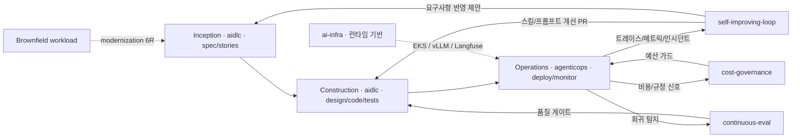

본 문서는 `oh-my-aidlcops`(OMA)의 설계 명제를 정리합니다. OMA가 기존 AIDLC 프레임워크에 **AgenticOps** 레이어를 결합한 이유, 이 조합이 왜 필연인지, 그리고 이 통합이 실제로 무엇을 자동화하는지를 설명합니다.

## OMA = 방법론의 실행 레이어 (신뢰성 2축)

OMA 의 출발점은 [AIDLC 방법론](https://devfloor9.github.io/engineering-playbook/docs/aidlc/methodology)이 정의한 **신뢰성 2축**입니다. 에이전틱 AIDLC 의 실패는 모델 역량이 아니라 신뢰성에서 발생하며, 방법론은 이를 두 축으로 나눕니다 — OMA 는 각 축을 설치 가능한 형태로 구현합니다.

| 축 | 질문 | 보장 | OMA 구현 | 상세 |
|---|---|---|---|---|
| **온톨로지 엔지니어링** | WHAT · WHEN | 정확성 (할루시네이션·드리프트 방지) | `schemas/ontology/` 8 엔티티, `oma validate` | [Ontology Engineering](./ontology-engineering.md) |
| **하네스 엔지니어링** | HOW | 안전성 (런어웨이·셀프채점 차단) | 하네스 DSL v2, `oma compile --strict-enterprise` | [Harness Engineering](./harness-engineering.md) |

아래에 이어지는 "Operations 미완결" 서사와 AgenticOps 레이어는 이 2축 위에서 **Outer Loop**(운영 신호 → 온톨로지 환류, 방법론 용어로 "살아있는 온톨로지")를 자동화하는 부분입니다. 즉 AgenticOps 는 별도 기능이 아니라 온톨로지 축의 가장 바깥 피드백 루프입니다.

두 축은 **이지버튼**으로 제공됩니다 — 사용자가 스키마·정책·훅을 직접 짜는 것이 아니라, 플러그인 설치만으로 typed 온톨로지와 하네스 DSL 이 활성화됩니다. 이 이지버튼 위에서 OMA 는 AWS Hosted MCP 를 기본 데이터 평면으로 삼고, 후속으로 **DevOps 에이전트**·**Security 에이전트** 를 동일한 Tier-0 승인 모델에 통합해 **엔터프라이즈 운영 자동화 오픈 툴셋**으로 확장됩니다.

---

## 문제 정의 — AIDLC의 미완결 구간

AWS 공식 [awslabs/aidlc-workflows](https://github.com/awslabs/aidlc-workflows)는 AI 주도 개발 수명주기를 세 단계로 구조화합니다.

1. **Inception** — 요구사항 분석, 사용자 스토리, 워크플로우 계획
2. **Construction** — 컴포넌트 설계, 코드 생성, 테스트 전략
3. **Operations** — 배포·모니터링·인시던트 대응·비용 관리

Inception과 Construction은 **설계·구현 행위가 에이전트의 자연스러운 작업 영역**이므로 자동화가 비교적 직관적입니다. 그러나 Operations는 실행 환경의 관측·판단·조치가 필요하며, 지금까지 대부분의 AIDLC 구현체는 이 단계를 **사람이 실행하는 영역**으로 남겨 두었습니다.

결과적으로 라이프사이클은 구조적으로 미완결입니다. 운영 단계에서 발생하는 피드백(에러, 지연, 비용 초과, 규정 위반)은 문서·이슈 트래커를 거쳐 다시 Construction으로 돌아갈 때까지 **일주일 단위의 지연**을 겪고, 그 과정에서 정보가 손실됩니다.

## OMA의 명제

> AIDLC는 운영이 에이전트로 자동화되었을 때 비로소 완성된다. 사람은 승인하고, 에이전트는 실행한다.

이 명제는 두 가지 주장을 포함합니다.

1. **Operations = 자동화 가능** — 최신 관측 스택(Langfuse, Prometheus, CloudWatch)과 AWS Hosted MCP의 조합은 에이전트에게 운영 판단을 위임할 수 있는 데이터 평면을 제공합니다.
2. **승인 ≠ 실행** — 사람은 Tier-0 체크포인트에서 승인 권한을 유지하되, 진단·제안·배포·롤백·튜닝 실행은 에이전트가 담당합니다.

## AgenticOps 레이어

OMA는 `agenticops` 플러그인을 통해 운영 단계에 다음 여섯 스킬을 상시 주입합니다.

| 스킬 | 역할 | 주요 입력 | 주요 출력 |
|---|---|---|---|
| `self-improving-loop` | 트레이스 기반 스킬·프롬프트 개선 | Langfuse 트레이스, 실패 패턴 | `aidlc` 플러그인 construction 스킬에 PR |

**주의**: `self-improving-loop` 를 비롯한 trace 기반 피드백 루프는 외부 Langfuse 인스턴스와 trace 읽기 MCP 서버가 프로파일(`observability.trace_mcp`)에 구성되었을 때에만 동작합니다. OMA 는 스킬과 계약을 제공하며, Langfuse 런타임은 사용자가 직접 운영합니다.
| `autopilot-deploy` | 검증된 아티팩트의 자율 배포 | CI 성공 아티팩트, 정책 게이트 | GitOps 커밋, 롤아웃 이벤트 |
| `incident-response` | 알람 → 진단 → 제안 → 실행 | PagerDuty, CloudWatch 알람 | RCA draft, 자동 완화 조치 |
| `continuous-eval` | 지속 품질 평가 | Ragas 메트릭, 회귀 데이터셋 | 품질 리포트, 롤백 신호 |
| `cost-governance` | 비용 이상 탐지·제어 | AWS Cost Explorer, 예산 정책 | 스케일 권고, 승인 요청 |
| `audit-trail` | 프롬프트·승인·전환점 verbatim 로깅 | 사용자 입력, 에이전트 행동, 체크포인트 결과 | SOC2/ISMS-P 보존 로그 (`.omao/audit.jsonl`) |

## 피드백 루프 구조

이 루프의 핵심은 **Operations → Construction 역방향 흐름**이 자동화된다는 점입니다. 기존 AIDLC 구현에서는 이 화살표가 인간의 이슈 분류와 백로그 관리에 의존했지만, OMA에서는 `self-improving-loop`가 트레이스 패턴을 분석해 구체적인 스킬·프롬프트 수정 PR을 생성합니다. 단, 이 Outer Loop 는 외부 Langfuse + trace MCP 가 프로파일(`observability.trace_mcp`)에 구성되어야 닫힙니다. OMA 는 피드백 루프 스킬과 MCP 계약을 제공하지만, trace 런타임 자체는 포함하지 않습니다.

## 참조 설계 — Self-Improving Agent Loop

OMA의 피드백 루프 개념은 engineering-playbook 프로젝트의 **Self-Improving Agent Loop ADR**에 기반합니다. 해당 ADR은 다음 요소를 설계 결정으로 명시합니다.

- 트레이스 수집 주기와 샘플링 전략
- 실패 패턴 분류 체계(Prompt / Skill / Tool / Infra)
- 자동 개선 PR의 범위 제약(비파괴·회귀 테스트 필수)
- 사람 리뷰 게이트와 자동 머지 정책 분리

OMA 리포지토리 내 정본은 다음과 같습니다. 외부 참고 ADR 이 공개되면 [REFERENCES.md](https://github.com/aws-samples/sample-oh-my-aidlcops/blob/main/REFERENCES.md) 에 추가됩니다.

- [`plugins/agenticops/skills/self-improving-loop/SKILL.md`](https://github.com/aws-samples/sample-oh-my-aidlcops/blob/main/plugins/agenticops/skills/self-improving-loop/SKILL.md) — 스킬 본문 (설계 결정, 입출력 계약, 실패 모드)
- [`steering/workflows/self-improving-deploy.md`](https://github.com/aws-samples/sample-oh-my-aidlcops/blob/main/steering/workflows/self-improving-deploy.md) — 5-checkpoint 워크플로우

## AgenticOps와 기존 DevOps의 관계

AgenticOps는 DevOps·SRE·MLOps를 대체하지 않습니다. 동일한 관측 스택과 배포 파이프라인을 공유하되, **실행 주체가 파이프라인이 아닌 에이전트**라는 점만 다릅니다.

| 측면 | 기존 DevOps/SRE | OMA AgenticOps |
|---|---|---|
| 배포 트리거 | 사람이 merge → 파이프라인 실행 | 에이전트가 정책 게이트 통과 확인 후 자율 배포 |
| 인시던트 대응 | PagerDuty → 온콜 엔지니어 | 알람 → `incident-response` 스킬 → 사람 승인 후 조치 |
| 품질 게이트 | CI 테스트 통과 | CI + Ragas + 회귀 샘플 지속 평가 |
| 비용 제어 | 월별 리뷰 | 예산 이상치 실시간 감지·자동 스케일 권고 |
| 개선 루프 | 레트로스펙티브 회의 | 트레이스 → 자동 개선 PR |

## 설계 원칙

OMA는 구현 선택에서 다음 원칙을 준수합니다(출처 [steering/oma-hub.md](https://github.com/aws-samples/sample-oh-my-aidlcops/blob/main/steering/oma-hub.md) 의 absolute rules).

1. **AIDLC 3-phase는 작업의 기본 단위** — 단계 스킵을 제도적으로 방지합니다(Phase gate).
2. **운영은 자동화 기본값** — 수동 개입이 기본이 아닙니다.
3. **전문 작업은 적절한 플러그인에 위임** — 단일 에이전트가 모든 것을 하지 않습니다.
4. **engineering-playbook이 지식 단일 출처** — 스킬은 요약과 링크만 유지합니다.
5. **AWS Hosted MCP가 기본 런타임 데이터 평면** — 명확한 공백이 발견되기 전까지 커스텀 MCP 서버를 만들지 않습니다.

## 기대 효과

OMA를 도입한 팀이 기대할 수 있는 정량적 변화는 다음과 같습니다(초기 타겟).

| 메트릭 | 기존 | 목표 | 측정 방식 |
|---|---|---|---|
| 이슈 → 개선 배포 리드 타임 | 주 단위 | 일 단위 | GitHub Issue open → PR merge |
| 평균 인시던트 대응 시간 | 30~60분 | 10분 이내 | 알람 발생 → 완화 조치 완료 |
| 회귀 감지율 | CI 테스트만 | CI + Ragas + 회귀 샘플 | 배포 후 24시간 품질 리포트 |
| 수동 운영 작업 비율 | 40%+ | 10% 이하 | 체크포인트 외 수동 조치 시간 |

수치는 환경에 따라 다르며, 지속 측정은 `agenticops/continuous-eval` 스킬로 수행합니다.

## 모더나이제이션 플러그인과의 관계

`modernization` 플러그인은 AIDLC 3단계 루프에 직접 속하지 않고, **브라운필드 진입 경로**를 담당합니다. 레거시 워크로드를 AWS 로 옮길 때의 6R 의사결정·워크로드 평가·컨테이너화·cutover 계획을 담당하고, 산출물을 Construction 단계의 입력으로 공급합니다.

| AIDLC 경로 | 사용 플러그인 | 시작점 |
|---|---|---|
| **Greenfield** — 새 기능·서비스를 AIDLC 로 설계하고 구현 | `aidlc` → `agenticops` | `/oma:autopilot` 또는 `/oma:aidlc-loop` |
| **Brownfield** — 레거시 워크로드를 AWS 로 현대화 | `modernization` → `aidlc` → `agenticops` | `/oma:modernize` → `/oma:aidlc-loop` → `/oma:agenticops` |
| **Platform** — 에이전틱 워크로드가 돌 런타임 자체를 구축 | `ai-infra` | `/oma:platform-bootstrap` |

세 경로 모두 Tier-0 체크포인트를 공유합니다 — 사람 승인 모델과 거버넌스 단위는 동일합니다.

## 철학적 전제 — "승인 시스템"으로서의 AIDLC

마지막 전제는 거버넌스 관점입니다. 에이전트 자율성이 높아질수록 **거버넌스의 단위는 "실행 단위"가 아닌 "승인 지점"이 됩니다.** OMA는 Tier-0 체크포인트를 이 승인 지점으로 정의하고, 체크포인트 사이의 모든 작업을 에이전트에 위임합니다. 이는 다음을 의미합니다.

- 감사 로그는 실행 단계별이 아닌 체크포인트 단위로 축약됩니다.
- 사람의 관심은 "누가 무엇을 실행했는가"에서 "어떤 정책 하에 승인되었는가"로 이동합니다.
- 비결정적 에이전트 실행을 감당할 수 있도록 체크포인트 정책이 명시적·버전 관리되어야 합니다.

## 참고 자료

### 공식 문서
- [awslabs/aidlc-workflows](https://github.com/awslabs/aidlc-workflows) — AIDLC core 정의
- [awslabs/mcp](https://github.com/awslabs/mcp) — AgenticOps 런타임 데이터 평면
- [Langfuse Documentation](https://langfuse.com/docs) — 트레이스 수집·분석 표준

### 참조 설계 · 스킬 본문
- [`plugins/agenticops/skills/self-improving-loop/SKILL.md`](https://github.com/aws-samples/sample-oh-my-aidlcops/blob/main/plugins/agenticops/skills/self-improving-loop/SKILL.md) — Self-Improving Loop 정본 (설계 결정 · 입출력 계약 · 실패 모드)
- [`steering/workflows/self-improving-deploy.md`](https://github.com/aws-samples/sample-oh-my-aidlcops/blob/main/steering/workflows/self-improving-deploy.md) — 5-checkpoint 워크플로우
- [`plugins/ai-infra/agents/platform-architect.md`](https://github.com/aws-samples/sample-oh-my-aidlcops/blob/main/plugins/ai-infra/agents/platform-architect.md) — Agentic AI Platform 아키텍처 에이전트

### OMA 내부 문서
- [Introduction](./intro.md) — OMA 개요
- [Tier-0 Workflows](./tier-0-workflows.md) — 체크포인트 기반 워크플로우 상세
- [Keyword Triggers](./keyword-triggers.md) — 승인 지점 진입 매커니즘
