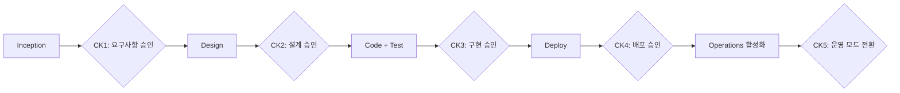
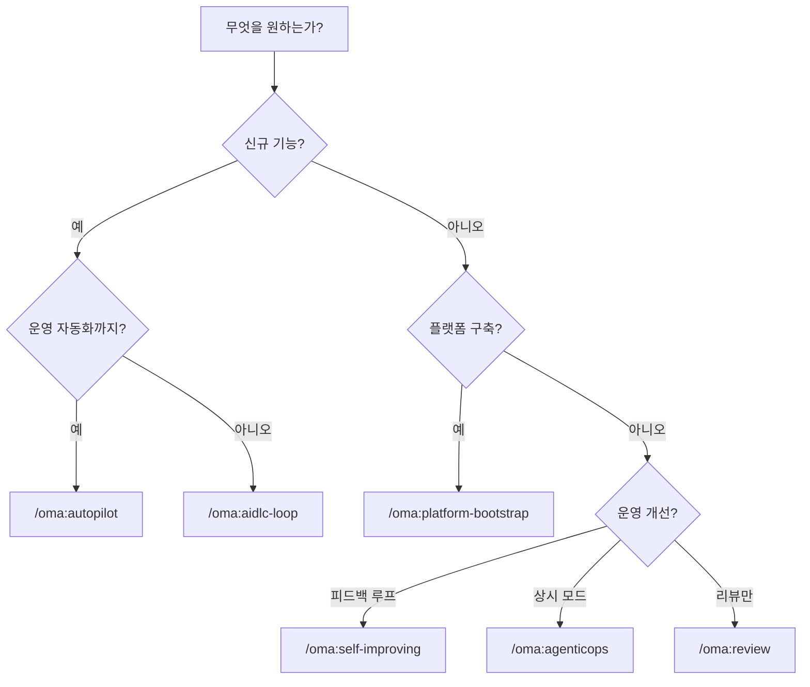

본 문서는 OMA가 제공하는 **9개 Tier-0 커맨드**의 심화 레퍼런스입니다. Tier-0는 "한 번 호출하면 체크포인트에서만 승인을 받고 자율 실행하는" 고레버리지 워크플로우를 의미하며, OMA의 핵심 가치가 집약된 진입점입니다.

## Tier-0 설계 원칙

모든 Tier-0 커맨드는 다음 원칙을 공유합니다.

1. **단일 호출** — 사용자는 커맨드를 한 번만 호출합니다. 에이전트는 여러 스킬·도구를 orchestrate합니다.
2. **체크포인트 기반 승인** — [aws-samples/sample-apex-skills](https://github.com/aws-samples/sample-apex-skills)의 5단계 패턴(Gather Context → Pre-flight → Plan → Execute → Validate)을 따릅니다.
3. **상태 영속화** — `.omao/state/session-<id>/`에 모든 체크포인트 결과가 저장됩니다. 중단 후 재개 가능합니다.
4. **자연어 인자** — 커맨드 인자는 자연어 문자열입니다. 에이전트가 의도를 파싱합니다.

## 커맨드 카탈로그

| 커맨드 | 범위 | 소요 시간 | 체크포인트 수 |
|---|---|---|---|
| `/oma:autopilot` | AIDLC 전체 루프 | 30분~수 시간 | 4~6 |
| `/oma:aidlc-loop` | 단일 feature 1회전 | 10~30분 | 2~3 |
| `/oma:inception` | Phase 1 단독 | 5~15분 | 1~2 |
| `/oma:construction` | Phase 2 단독 | 10~30분 | 2~3 |
| `/oma:agenticops` | 운영 모드 활성화 | 즉시 | 1 (활성화 승인) |
| `/oma:self-improving` | 트레이스 → 개선 PR | 5~20분 | 2 |
| `/oma:platform-bootstrap` | EKS 플랫폼 구축 | 30~60분 | 5 |
| `/oma:review` | 산출물 리뷰 | 2~10분 | 0 (리포트만) |
| `/oma:cancel` | Tier-0 종료 | 즉시 | 0 |

이하 각 커맨드를 상세히 설명합니다.

## `/oma:autopilot` — AIDLC 전체 루프 자율 실행

### 목적
단일 feature 또는 전체 프로젝트에 대해 Inception → Construction → Operations를 end-to-end로 수행합니다. 사람 개입은 체크포인트 승인으로 한정됩니다.

### 호출 예시
```bash
> /oma:autopilot "결제 서비스에 이상 거래 탐지 기능을 신규 구축해 운영 단계까지 완성하라"
```

### 체크포인트 흐름


### 사용 시나리오
- 신규 feature 초기 구축
- 프로젝트 킥오프 시 AIDLC 전체 일관성 검증
- 팀 전환 시 같은 feature를 OMA 표준으로 재구축

### 의존성
- `aidlc` + `aidlc` + `agenticops` 플러그인 활성화
- `eks-mcp-server`, `cloudwatch-mcp-server`, `aws-iac-mcp-server` MCP 연결

## `/oma:aidlc-loop` — 단일 feature 1회전

### 목적
Operations 단계까지 가지 않고, Inception + Construction만 1회전 수행합니다. 운영 자동화가 이미 구성된 환경에서 신규 feature를 빠르게 합류시킬 때 사용합니다.

### 호출 예시
```bash
> /oma:aidlc-loop "사용자 프로필 API에 MFA 검증 필드를 추가하라"
```

### 체크포인트 흐름
CK1 (요구사항) → CK2 (설계·구현) 2단계.

### 사용 시나리오
- 일상적인 기능 추가·수정
- CI 파이프라인 내 자동 호출 (승인은 별도 워크플로우)
- `autopilot`의 운영 부분을 건너뛰고 싶을 때

## `/oma:inception` — Phase 1 단독

### 목적
요구사항 분석·사용자 스토리·워크플로우 계획 산출물만 생성합니다. 설계·구현을 사람이 직접 수행할 때 사용합니다.

### 호출 예시
```bash
> /oma:inception "차세대 주문 관리 시스템의 초기 요구사항을 정리하라"
```

### 산출물
```
.omao/plans/
├── spec.md
├── user-stories.md
└── workflow-plan.md
```

### 사용 시나리오
- 디자인 스프린트·워크숍 사전 준비
- 제품 매니저가 요구사항 초안을 자동 생성
- Construction 단계를 외부 개발팀에 위임하는 경우

## `/oma:construction` — Phase 2 단독

### 목적
기존 `.omao/plans/spec.md`가 있는 상태에서 설계·구현 산출물을 생성합니다. Inception이 이미 완료된 경우 사용합니다.

### 호출 예시
```bash
> /oma:construction "현재 spec.md 기준으로 컴포넌트 설계와 TDD 구현을 수행하라"
```

### 산출물
```
.omao/plans/
├── design.md
├── adr-*.md
├── test-strategy.md
└── (코드 변경 diff는 feature branch에 커밋)
```

### 사용 시나리오
- 다른 도구로 작성된 spec을 `.omao/plans/spec.md`로 복사 후 실행
- Inception을 수동으로 재작업한 후 Construction만 다시 수행
- 레거시 코드베이스에 OMA 표준 설계·테스트를 역산

## `/oma:agenticops` — 운영 모드 활성화

### 목적
`continuous-eval`·`incident-response`·`cost-governance` 세 스킬을 백그라운드로 활성화하여 운영 자동화를 상시 구동합니다. 단일 회 실행이 아닌 **상태 전환 커맨드**입니다.

### 호출 예시
```bash
> /oma:agenticops "prod 클러스터 운영 모드를 활성화하라"
```

### 활성화 이후 동작
- **continuous-eval** — Ragas 메트릭·회귀 샘플을 주기적으로 평가, 회귀 감지 시 롤백 신호 전송
- **incident-response** — PagerDuty·CloudWatch 알람에 자동 대응, 진단·완화 제안 생성
- **cost-governance** — AWS Cost Explorer 이상치 감지, 예산 초과 시 스케일 권고

### 비활성화
```bash
> /oma:cancel
```

### 사용 시나리오
- 프로덕션 클러스터 배포 직후
- 엔드 오브 스프린트에서 운영 자동화 체크포인트 갱신
- 연휴·주말 동안 on-call 부담을 줄이려는 경우

## `/oma:self-improving` — 트레이스 → 개선 PR

### 목적
Langfuse 트레이스와 실패 로그를 분석해 스킬·프롬프트를 개선하는 PR을 자동 생성합니다. 피드백 루프의 핵심입니다.

**전제 조건**: 외부 Langfuse 인스턴스와 trace 읽기 MCP 서버가 프로파일(`observability.trace_mcp`)에 구성되어 있어야 합니다. OMA 는 스킬과 MCP 계약을 제공하지만, Langfuse 런타임은 포함하지 않습니다.

### 호출 예시
```bash
> /oma:self-improving "지난 7일 간 실패 트레이스를 분석해 개선 PR을 제안하라"
```

### 체크포인트 흐름
CK1: 개선 후보 제안 승인 → CK2: 회귀 테스트 통과 확인 후 PR 생성.

### 산출물
- GitHub PR (자동 라벨 `agenticops/auto-improvement`)
- `.omao/plans/improvement-<date>.md` 요약 리포트

### 사용 시나리오
- 주간 운영 회의 직전 자동 실행
- 실패율 임계치를 넘은 특정 스킬에 대해 수동 호출
- 신규 모델 버전 출시 후 프롬프트 최적화

## `/oma:platform-bootstrap` — EKS 플랫폼 5단계 구축

### 목적
Agentic AI Platform을 EKS 위에 **5단계 체크포인트**로 구축합니다. vLLM 추론, Inference Gateway, Langfuse 관측, Kagent 오케스트레이션, GPU 리소스 관리의 전 스택을 다룹니다.

### 호출 예시
```bash
> /oma:platform-bootstrap "GPU 노드 8대 규모로 Agentic AI Platform을 구축하라"
```

### 5단계 체크포인트
1. **Cluster 준비** — EKS 버전·VPC·Karpenter 구성 검증
2. **GPU·모델 서빙** — NVIDIA GPU Operator, vLLM 배포
3. **Inference Gateway** — kgateway + 라우팅 규칙
4. **관측성** — Langfuse + Prometheus + OpenTelemetry 연결
5. **에이전트 레이어** — Kagent + Ragas 평가 파이프라인

### 의존성
- `ai-infra` 플러그인 활성화
- `eks-mcp-server`, `prometheus-mcp-server`, `aws-iac-mcp-server` 연결
- 충분한 EKS 권한(최소 `eks:*`, `ec2:*`, `iam:CreateRole`)

### 사용 시나리오
- 신규 클러스터에서 플랫폼 최초 구축
- 기존 클러스터를 OMA 표준으로 재구성
- PoC·데모 환경의 1일 구축

## `/oma:review` — 산출물 리뷰

### 목적
AIDLC 산출물(ADR, spec, design, PR)을 분석해 품질 리포트를 생성합니다. 실행 변경은 없으며, 리뷰 결과만 반환합니다.

### 호출 예시
```bash
> /oma:review ".omao/plans/adr-auth-refactor.md 를 리뷰하라"
> /oma:review "현재 PR #123 을 리뷰하라"
```

### 리뷰 항목
- AIDLC 구조 준수 여부
- 누락된 ADR·테스트·설계 문서
- engineering-playbook 표준과의 정합성
- 보안·비용·규정 고려사항

### 사용 시나리오
- PR 머지 전 자동 자기 리뷰
- 분기별 품질 감사
- 신규 팀원의 초기 산출물 피드백

## `/oma:cancel` — Tier-0 종료

### 목적
활성 Tier-0 모드를 즉시 종료합니다. `autopilot`·`agenticops` 등 장기 실행 커맨드를 중단할 때 사용합니다.

### 호출 예시
```bash
> /oma:cancel
```

### 동작
- `.omao/state/active-mode.json`에서 현재 모드 제거
- 백그라운드로 실행 중인 스킬에 종료 신호 전송
- 부분 산출물은 `.omao/state/session-<id>/`에 보존 (복구 가능)

## 공통 옵션

모든 Tier-0 커맨드는 다음 공통 옵션을 지원합니다.

| 옵션 | 효과 |
|---|---|
| `--dry-run` | 계획만 생성하고 실행하지 않음 |
| `--verbose` | 단계별 중간 산출물 상세 출력 |
| `--resume <session-id>` | 중단된 세션을 이어서 실행 |

예시:
```bash
> /oma:autopilot --dry-run "결제 서비스에 이상 거래 탐지 기능을 추가하라"
> /oma:autopilot --resume session-2026-04-21-a1b2 "이어서 진행하라"
```

## 체크포인트 구조 심화

체크포인트는 `.omao/state/session-<id>/checkpoint-<n>.json` 구조로 저장됩니다.

```json
{
  "checkpoint": 2,
  "phase": "construction",
  "timestamp": "2026-04-21T14:32:10Z",
  "inputs": {
    "spec_path": ".omao/plans/spec.md"
  },
  "artifacts": [
    ".omao/plans/design.md",
    ".omao/plans/adr-auth.md"
  ],
  "approval": {
    "status": "approved",
    "approver": "user",
    "comment": null
  }
}
```

중단·재개 시 이 파일들이 복원 기준점이 됩니다. 수동으로 체크포인트 결과를 편집할 수도 있으며, 이는 `--resume`과 결합해 유연한 워크플로우 재구성을 가능하게 합니다.

## 커맨드 선택 가이드

어느 커맨드를 사용할지 판단하는 결정 트리입니다.



## 참고 자료

### 공식 문서
- [aws-samples/sample-apex-skills](https://github.com/aws-samples/sample-apex-skills) — 5-체크포인트 템플릿 원본
- [Langfuse Documentation](https://langfuse.com/docs) — self-improving 루프 데이터 소스
- [awslabs/mcp](https://github.com/awslabs/mcp) — Tier-0가 의존하는 MCP 서버들

### OMA 내부 문서
- [Introduction](./intro.md) — OMA 개요와 플러그인 카탈로그
- [Philosophy](./philosophy-aidlc-meets-agenticops.md) — Tier-0 설계 배경
- [Keyword Triggers](./keyword-triggers.md) — 자연어 입력 → Tier-0 자동 매핑
- [Claude Code Setup](./claude-code-setup.md) — Tier-0 실행을 위한 사전 설치
