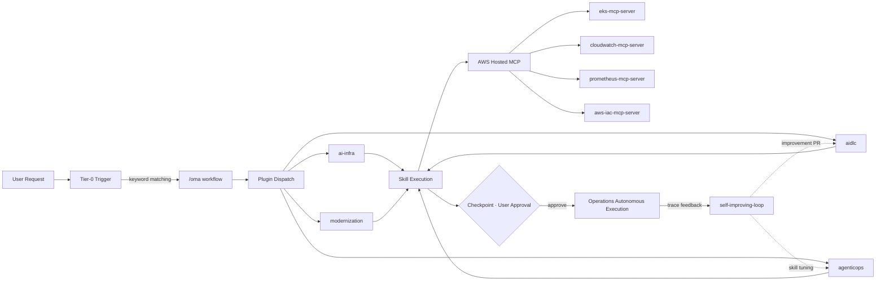

`oh-my-aidlcops` (OMA) is a **Claude Code · Kiro plugin marketplace** that turns the two reliability axes of the [AIDLC methodology](https://devfloor9.github.io/engineering-playbook/docs/aidlc/methodology) — **Ontology Engineering** (correctness) and **Harness Engineering** (safety) — into installable plugins on AWS. AWS's official AIDLC Workflows serve as the process spine, and AgenticOps closes the feedback loop back into the ontology. OMA is a sister project of [oh-my-claudecode](https://github.com/Yeachan-Heo/oh-my-claudecode) (OMC), specializing its orchestration philosophy in making the AIDLC loop reliable enough to run with agents.

## One-Paragraph Summary

Agentic AIDLC fails on reliability, not capability — hallucination/drift, runaway execution, and self-grading. The methodology answers with a **reliability dual-axis**: Ontology Engineering guarantees the correctness of what agents produce (WHAT/WHEN), and Harness Engineering enforces the safety of how they execute (HOW). OMA is the installable implementation of that dual-axis: a one-install **easy button** that activates a typed ontology, a harness DSL, and AWS Hosted MCP wiring without hand-rolling schemas, policies, or hooks. Users approve at checkpoints; agents handle diagnosis, proposal, and execution.

## Where this is going — an enterprise operations open toolset

OMA is being built into an **open toolset for enterprise operations automation**:

1. **Today** — Ontology + Harness Engineering as installable plugins, AWS Hosted MCP (awslabs/mcp) as the default runtime data layer, AgenticOps closing the Outer Loop.
2. **Next** — deeper AWS Hosted MCP coverage plus first-class **DevOps agent** and **Security agent** integrations, so deploy, observability, and security review run as governed agents inside the same Tier-0 approval model.
3. **The promise** — install a few plugins and get enterprise-grade operations automation that is auditable, policy-gated, and harness-constrained by default — a drop-in open toolset, not a bespoke platform you assemble yourself.

## Plugin Catalog

| Plugin | Role | Example Skills |
|---|---|---|
| `ai-infra` | Build and operate Agentic AI Platform on EKS | `agentic-eks-bootstrap`, `vllm-serving-setup`, `inference-gateway-routing`, `langfuse-observability`, `gpu-resource-management`, `ai-gateway-guardrails` |
| `agenticops` | Agent-driven operations automation | `self-improving-loop`, `autopilot-deploy`, `incident-response`, `continuous-eval`, `cost-governance`, `audit-trail` |
| `aidlc` | AIDLC Phase 1 (Inception) + Phase 2 (Construction) extensions (opt-in) | `requirements-analysis`, `user-stories`, `workflow-planning`, `component-design`, `code-generation`, `test-strategy`, `risk-discovery`, `quality-gates` |
| `modernization` | Legacy workload modernization to AWS (6R strategy) | `workload-assessment`, `modernization-strategy`, `to-be-architecture`, `containerization`, `cutover-planning` |

Detailed plugin definitions are in the repository root at [`.claude-plugin/marketplace.json`](https://github.com/aws-samples/sample-oh-my-aidlcops/blob/main/.claude-plugin/marketplace.json).

## Tier-0 Workflows

Tier-0 workflows are high-leverage operations that start an entire flow with a single invocation and require user approval only at checkpoints.

| Command | Purpose |
|---|---|
| `/oma:autopilot` | Autonomous AIDLC full-loop execution (Inception → Construction → Operations) |
| `/oma:aidlc-loop` | Single feature AIDLC one-pass |
| `/oma:inception` | Phase 1 only |
| `/oma:construction` | Phase 2 only |
| `/oma:agenticops` | Operations mode (continuous-eval + incident-response + cost-governance running in parallel) |
| `/oma:self-improving` | Langfuse traces → skill/prompt improvement PR feedback loop |
| `/oma:platform-bootstrap` | Agentic AI Platform 5-checkpoint bootstrap on EKS |
| `/oma:review` | AIDLC artifact review (ADR, spec, design, PR) |
| `/oma:cancel` | Terminate active Tier-0 mode |

See [Tier-0 Workflows](./tier-0-workflows.md) for detailed invocation of each command.

## AIDLC × AgenticOps Fusion Diagram

The diagram above shows how the AIDLC 3-phase structure closes via an agent-driven feedback loop. Observability data from the Operations phase (Langfuse traces, Prometheus metrics, CloudWatch logs) flows back through `self-improving-loop` to automatically improve Construction-phase skills and prompts. Note that trace-based feedback requires an external Langfuse instance plus a trace MCP server configured in the profile (`observability.trace_mcp`).

## Supported Harnesses (Dual Harness)

OMA operates identically across two agent harnesses.

- **Claude Code** — Install via native `/plugin marketplace add` or `bash scripts/install/claude.sh` (or `oma setup`). Integrates into `.claude/plugins/`, `.claude/commands/oma/`, and `.claude/settings.json`.
- **Kiro** — Install via `bash scripts/install/kiro.sh` (or select `harness=kiro` in `oma setup`). Symlinks `SKILL.md` to `.kiro/skills/` and steering to `.kiro/steering/`.
- **Shared state** — The `.omao/` directory at project root is harness-agnostic; both harnesses read and write the same files.
- **Recommended path** — Single `oma setup` command handles profile + seed ontology + plugin installation all at once. See [Easy Button](./easy-button.md) for details.

Installation and configuration for each harness are covered in [Claude Code Setup](./claude-code-setup.md) and [Kiro Setup](./kiro-setup.md).

## Target Users

- **Platform engineers** building and operating Agentic AI platforms on AWS EKS
- **LLM and agent operations teams** seeking to cover planning through operations with AIDLC
- **Claude Code or Kiro users** who prefer validated drop-in marketplace plugins over building custom skills

## Reused Assets

OMA follows the principle of reuse over reinvention. Full attribution is documented in [NOTICE](https://github.com/aws-samples/sample-oh-my-aidlcops/blob/main/NOTICE).

| Source | License | How Used |
|---|---|---|
| [awslabs/agent-plugins](https://github.com/awslabs/agent-plugins) | Apache-2.0 | Plugin, Skill, MCP, and Marketplace JSON schemas adopted |
| [awslabs/aidlc-workflows](https://github.com/awslabs/aidlc-workflows) | MIT-0 | Used as AIDLC core; contributions are `*.opt-in.md` extensions only |
| [awslabs/mcp](https://github.com/awslabs/mcp) | Apache-2.0 | 11 hosted MCP servers referenced |
| [aws-samples/sample-apex-skills](https://github.com/aws-samples/sample-apex-skills) | MIT-0 | 5-checkpoint workflow template |
| [oh-my-claudecode](https://github.com/Yeachan-Heo/oh-my-claudecode) | — | Tier-0 orchestration philosophy and `.omc/` state management inherited |

## Next Steps

1. [Getting Started](./getting-started.md) — 5-minute Quickstart to experience your first Tier-0 execution.
2. [Philosophy](./philosophy-aidlc-meets-agenticops.md) — Understand the AIDLC × AgenticOps design premise.
3. [Claude Code Setup](./claude-code-setup.md) or [Kiro Setup](./kiro-setup.md) — Proceed with actual installation.

## Reference Materials

### Official Documentation
- [awslabs/aidlc-workflows](https://github.com/awslabs/aidlc-workflows) — AIDLC core workflow official repository
- [awslabs/agent-plugins](https://github.com/awslabs/agent-plugins) — Plugin, skill, and marketplace standards
- [awslabs/mcp](https://github.com/awslabs/mcp) — AWS Hosted MCP servers collection

### Related Projects
- [oh-my-claudecode](https://github.com/Yeachan-Heo/oh-my-claudecode) — General-purpose Claude Code orchestration (OMA's parent project)
- [oh-my-aidlcops Repository](https://github.com/aws-samples/sample-oh-my-aidlcops) — Source code and issue tracker

### OMA Internal Documentation
- [Getting Started](./getting-started.md) — 5-minute Quickstart
- [Tier-0 Workflows](./tier-0-workflows.md) — Complete command reference
