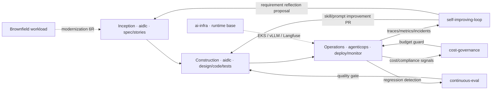

This document synthesizes the design premise of `oh-my-aidlcops` (OMA). It explains why OMA combines an **AgenticOps** layer with the existing AIDLC framework, why this combination is inevitable, and what this integration actually automates.

## OMA = the methodology's execution layer (reliability dual-axis)

OMA's starting point is the **reliability dual-axis** defined by the [AIDLC methodology](https://devfloor9.github.io/engineering-playbook/docs/aidlc/methodology). Agentic AIDLC fails on reliability, not model capability, and the methodology splits that reliability into two axes — OMA implements each as an installable surface.

| Axis | Question | Guarantee | OMA implementation | Detail |
|---|---|---|---|---|
| **Ontology Engineering** | WHAT · WHEN | Correctness (prevents hallucination/drift) | `schemas/ontology/` 8 entities, `oma validate` | [Ontology Engineering](./ontology-engineering.md) |
| **Harness Engineering** | HOW | Safety (blocks runaway/self-grading) | Harness DSL v2, `oma compile --strict-enterprise` | [Harness Engineering](./harness-engineering.md) |

The "incomplete Operations" narrative below and the AgenticOps layer automate the **Outer Loop** (operational signal → ontology feedback, the methodology's "living ontology") on top of these two axes. AgenticOps is not a separate feature; it is the outermost feedback loop of the ontology axis.

Both axes ship as an **easy button** — instead of hand-rolling schemas, policies, and hooks, installing the plugins activates a typed ontology and the harness DSL. On top of that easy button, OMA uses AWS Hosted MCP as the default data plane and extends — with first-class **DevOps agent** and **Security agent** integrations under the same Tier-0 approval model — into an **open toolset for enterprise operations automation**.

## Problem Statement — The Incomplete AIDLC Interval

AWS's official [awslabs/aidlc-workflows](https://github.com/awslabs/aidlc-workflows) structures the AI-driven development lifecycle into three phases:

1. **Inception** — Requirements analysis, user stories, workflow planning
2. **Construction** — Component design, code generation, test strategy
3. **Operations** — Deployment, monitoring, incident response, cost management

Inception and Construction are naturally automated because **agent-driven planning and implementation are intuitive work for agents**. However, Operations requires observation, judgment, and action in live environments. Most AIDLC implementations have left this phase as **a human execution domain**.

As a result, the lifecycle is structurally incomplete. Feedback from operations (errors, latency, cost overruns, compliance violations) loops back through documentation and issue trackers to Construction with **week-long delays**, and information is lost in transit.

## OMA's Premise

> AIDLC becomes complete only when operations is automated by agents. Humans approve; agents execute.

This premise contains two claims:

1. **Operations = automatable** — Modern observability stacks (Langfuse, Prometheus, CloudWatch) combined with AWS Hosted MCP provide agents with data planes sufficient to delegate operational judgment.
2. **Approval ≠ execution** — Humans retain approval authority at Tier-0 checkpoints, but agents own diagnosis, proposal, deployment, rollback, and tuning execution.

## AgenticOps Layer

Through the `agenticops` plugin, OMA injects five skills into the operations phase continuously:

| Skill | Role | Key Input | Key Output |
|---|---|---|---|
| `self-improving-loop` | Trace-based skill and prompt improvement | Langfuse traces, failure patterns | PR to `aidlc` |

**Note**: `self-improving-loop` and other trace-based feedback loops require an external Langfuse instance plus a trace-reading MCP server configured in the profile (`observability.trace_mcp`). OMA provides the skills and the contract; the Langfuse runtime is operated by the user.
| `autopilot-deploy` | Autonomous deployment of validated artifacts | CI success artifacts, policy gates | GitOps commits, rollout events |
| `incident-response` | Alarm → diagnosis → proposal → action | PagerDuty, CloudWatch alarms | RCA draft, auto-mitigation actions |
| `continuous-eval` | Sustained quality assessment | Ragas metrics, regression datasets | Quality report, rollback signals |
| `cost-governance` | Cost anomaly detection and control | AWS Cost Explorer, budget policy | Scale recommendations, approval requests |

## Feedback Loop Structure

The core of this loop is the **automated Operations → Construction reverse flow**. In traditional AIDLC implementations, this arrow depended on human issue classification and backlog management. In OMA, `self-improving-loop` analyzes trace patterns and generates concrete skill and prompt fix PRs. However, this Outer Loop closes only when an external Langfuse + trace MCP is configured in the profile (`observability.trace_mcp`). OMA provides the feedback loop skills and the MCP contract, but does not include the trace runtime itself.

## Reference Design — Self-Improving Agent Loop

OMA's feedback loop concept is based on the **Self-Improving Agent Loop ADR** in the engineering-playbook project. That ADR specifies as design decisions:

- Trace collection cadence and sampling strategy
- Failure pattern taxonomy (Prompt / Skill / Tool / Infra)
- Scope constraints for auto-improvement PRs (non-destructive, regression tests required)
- Separation of human review gates and auto-merge policy

See the links below for detailed decision rationale and alternative comparisons.

- Self-Improving Agent Loop (design) (community resource)
- ADR: Self-Improving Loop (decision) (community resource)

## AgenticOps and Traditional DevOps Relationship

AgenticOps does not replace DevOps, SRE, or MLOps. It shares the same observability stack and deployment pipeline but **differs only in who executes: agents instead of pipelines**.

| Aspect | Traditional DevOps/SRE | OMA AgenticOps |
|---|---|---|
| Deployment trigger | Human merge → pipeline runs | Agent confirms policy gates, autonomous deploy |
| Incident response | PagerDuty → on-call engineer | Alarm → `incident-response` skill → human approval then action |
| Quality gates | CI tests pass | CI + Ragas + ongoing regression sampling |
| Cost control | Monthly review | Real-time anomaly detection and auto-scaling recommendations |
| Improvement loop | Retrospective meeting | Traces → auto-improvement PR |

## Design Principles

OMA adheres to these principles in implementation choices (source: the absolute rules in [steering/oma-hub.md](https://github.com/aws-samples/sample-oh-my-aidlcops/blob/main/steering/oma-hub.md)):

1. **AIDLC 3-phase is the basic unit of work** — Institutional prevention of phase skipping (Phase gate).
2. **Operations default to automation** — Manual intervention is not the default.
3. **Specialized work delegated to appropriate plugins** — No single agent does everything.
4. **engineering-playbook is the knowledge single source of truth** — Skills maintain summaries and links only.
5. **AWS Hosted MCP is the default runtime data plane** — No custom MCP servers until a clear gap is identified.

## Expected Impact

Teams adopting OMA can expect the following quantitative changes (early targets):

| Metric | Legacy | Goal | Measurement |
|---|---|---|---|
| Issue → improvement deployment lead time | Week scale | Day scale | GitHub Issue open → PR merge |
| Mean incident response time | 30–60 minutes | Under 10 minutes | Alarm triggered → mitigation complete |
| Regression detection rate | CI tests only | CI + Ragas + regression samples | 24-hour post-deployment quality report |
| Manual ops work ratio | 40%+ | 10% or less | Manual effort outside checkpoints |

Numbers vary by environment. Continuous measurement is performed via `agenticops/continuous-eval` skill.

## Philosophical Foundation — AIDLC as an "Approval System"

A final premise is governance. As agent autonomy increases, **governance's unit shifts from "execution unit" to "approval point."** OMA defines Tier-0 checkpoints as these approval points and delegates all work between checkpoints to agents. This means:

- Audit logs are condensed to checkpoint units rather than per-execution-stage.
- Human focus shifts from "who executed what" to "under what policy was this approved."
- Governance of non-deterministic agent execution requires explicit, version-controlled checkpoint policies.

## Reference Materials

### Official Documentation
- [awslabs/aidlc-workflows](https://github.com/awslabs/aidlc-workflows) — AIDLC core definition
- [awslabs/mcp](https://github.com/awslabs/mcp) — AgenticOps runtime data plane
- [Langfuse Documentation](https://langfuse.com/docs) — Trace collection and analysis standard

### Reference ADR and Design Documents
- Self-Improving Agent Loop Design (community resource) — Traces → improvement loop design
- ADR: Self-Improving Loop (community resource) — Decision rationale
- Agentic AI Platform Architecture (community resource) — Overall platform structure

### OMA Internal Documentation
- [Introduction](./intro.md) — OMA overview
- [Tier-0 Workflows](./tier-0-workflows.md) — Checkpoint-based workflow details
- [Keyword Triggers](./keyword-triggers.md) — Approval checkpoint entry mechanism
