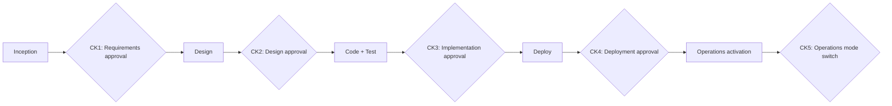
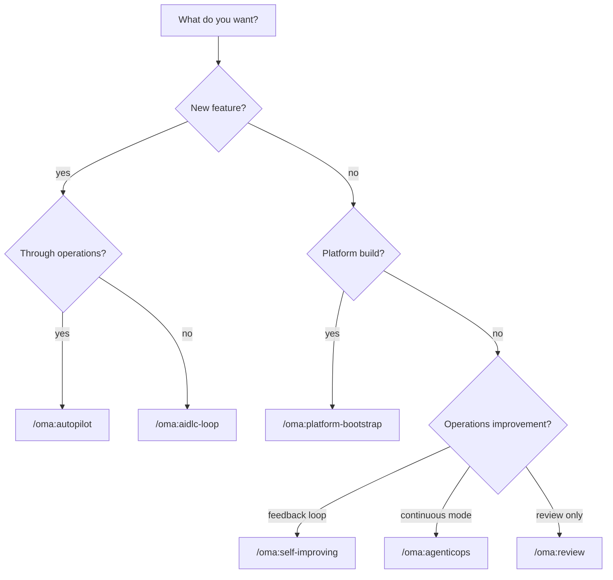

This document is a deep reference for the **9 Tier-0 commands** that OMA provides. Tier-0 means "invoke once, run autonomously with approval only at checkpoints"—high-leverage workflows where OMA's core value concentrates.

## Tier-0 Design Principles

All Tier-0 commands share these principles:

1. **Single invocation** — Users invoke the command once. Agents orchestrate multiple skills and tools.
2. **Checkpoint-based approval** — Follows the 5-stage pattern from [aws-samples/sample-apex-skills](https://github.com/aws-samples/sample-apex-skills): Gather Context → Pre-flight → Plan → Execute → Validate.
3. **State persistence** — All checkpoint results are saved in `.omao/state/session-<id>/`. Pause and resume are supported.
4. **Natural language arguments** — Command arguments are natural language strings. Agents parse intent.

## Command Catalog

| Command | Scope | Time | Checkpoints |
|---|---|---|---|
| `/oma:autopilot` | Full AIDLC loop | 30min–hours | 4–6 |
| `/oma:aidlc-loop` | Single feature one-pass | 10–30min | 2–3 |
| `/oma:inception` | Phase 1 only | 5–15min | 1–2 |
| `/oma:construction` | Phase 2 only | 10–30min | 2–3 |
| `/oma:agenticops` | Activate operations mode | immediate | 1 (activation approval) |
| `/oma:self-improving` | Traces → improvement PR | 5–20min | 2 |
| `/oma:platform-bootstrap` | EKS platform 5-stage build | 30–60min | 5 |
| `/oma:review` | Artifact review | 2–10min | 0 (report only) |
| `/oma:cancel` | Tier-0 termination | immediate | 0 |

Detailed descriptions of each command follow.

## `/oma:autopilot` — Full AIDLC Loop Autonomous Execution

### Purpose
Performs Inception → Construction → Operations end-to-end for a single feature or whole project. Human involvement limited to checkpoint approvals.

### Invocation Example
```bash
> /oma:autopilot "Build a new anomaly detection feature in the payment service, from planning through operations"
```

### Checkpoint Flow


### Use Cases
- Initial feature build
- Full AIDLC consistency validation at project kickoff
- Rebuilding a feature under OMA standards during team transitions

### Dependencies
- `aidlc` + `aidlc` + `agenticops` plugins active
- `eks-mcp-server`, `cloudwatch-mcp-server`, `aws-iac-mcp-server` MCP connections

## `/oma:aidlc-loop` — Single Feature One-Pass

### Purpose
Inception + Construction one-pass without the Operations phase. Use when operations automation is already configured and you need to quickly integrate a new feature.

### Invocation Example
```bash
> /oma:aidlc-loop "Add MFA verification field to the user profile API"
```

### Checkpoint Flow
CK1 (requirements) → CK2 (design & implementation). Two stages.

### Use Cases
- Daily feature additions and fixes
- Auto-invocation within CI pipelines (approval via separate workflow)
- Skipping the operations portion of `autopilot`

## `/oma:inception` — Phase 1 Only

### Purpose
Generate requirements analysis, user stories, and workflow planning artifacts only. Use when design and implementation are handled manually.

### Invocation Example
```bash
> /oma:inception "Gather initial requirements for the next-generation order management system"
```

### Artifacts
```
.omao/plans/
├── spec.md
├── user-stories.md
└── workflow-plan.md
```

### Use Cases
- Pre-workshop and design sprint preparation
- Product manager auto-generating requirements drafts
- Delegating Construction to external dev teams

## `/oma:construction` — Phase 2 Only

### Purpose
Generate design and implementation artifacts given an existing `.omao/plans/spec.md`. Use when Inception is already complete.

### Invocation Example
```bash
> /oma:construction "Based on current spec.md, perform component design and TDD implementation"
```

### Artifacts
```
.omao/plans/
├── design.md
├── adr-*.md
├── test-strategy.md
└── (code changes committed to feature branch)
```

### Use Cases
- Copy-pasting spec from other tools into `.omao/plans/spec.md` then executing
- Re-running Construction after manually revising Inception
- Retrofitting OMA standard design and tests to legacy codebases

## `/oma:agenticops` — Activate Operations Mode

### Purpose
Activate `continuous-eval`, `incident-response`, and `cost-governance` skills in the background for continuous operations automation. This is a **state transition command**, not a one-time execution.

### Invocation Example
```bash
> /oma:agenticops "Activate operations mode for the production cluster"
```

### Post-Activation Behavior
- **continuous-eval** — Periodically evaluate Ragas metrics and regression samples; send rollback signal on regression detection
- **incident-response** — Auto-respond to PagerDuty and CloudWatch alarms, generate diagnosis and mitigation proposals
- **cost-governance** — Detect AWS Cost Explorer anomalies, recommend scaling on budget excess

### Deactivation
```bash
> /oma:cancel
```

### Use Cases
- Immediately after production cluster deployment
- End-of-sprint operations automation checkpoint refresh
- Reducing on-call burden during holidays and weekends

## `/oma:self-improving` — Traces → Improvement PR

### Purpose
Analyze Langfuse traces and failure logs to auto-generate PRs for skill and prompt improvements. Core of the feedback loop.

**Prerequisites**: Requires an external Langfuse instance plus a trace-reading MCP server configured in the profile (`observability.trace_mcp`). OMA provides the skill and the MCP contract, but does not include the Langfuse runtime.

### Invocation Example
```bash
> /oma:self-improving "Analyze failures from the last 7 days and propose improvement PRs"
```

### Checkpoint Flow
CK1: Approve improvement candidates → CK2: Confirm regression tests pass, create PR.

### Artifacts
- GitHub PR (auto-labeled `agenticops/auto-improvement`)
- `.omao/plans/improvement-<date>.md` summary report

### Use Cases
- Auto-run before weekly operations meetings
- Manual invocation when specific skill failure rate exceeds threshold
- Prompt optimization after new model version release

## `/oma:platform-bootstrap` — EKS Platform 5-Stage Build

### Purpose
Build an Agentic AI Platform on EKS with **5-stage checkpoints**. Covers full stack: vLLM inference, Inference Gateway, Langfuse observability, Kagent orchestration, and GPU resource management.

### Invocation Example
```bash
> /oma:platform-bootstrap "Build Agentic AI Platform at 8-node GPU scale"
```

### 5-Stage Checkpoints
1. **Cluster Prep** — Validate EKS version, VPC, and Karpenter configuration
2. **GPU & Model Serving** — Deploy NVIDIA GPU Operator and vLLM
3. **Inference Gateway** — Deploy kgateway with routing rules
4. **Observability** — Connect Langfuse + Prometheus + OpenTelemetry
5. **Agent Layer** — Deploy Kagent + Ragas evaluation pipeline

### Dependencies
- `ai-infra` plugin active
- `eks-mcp-server`, `prometheus-mcp-server`, `aws-iac-mcp-server` connections
- Sufficient EKS permissions (minimum `eks:*`, `ec2:*`, `iam:CreateRole`)

### Use Cases
- First-time platform build on new cluster
- Reconfiguring existing cluster to OMA standards
- One-day PoC and demo environment setup

## `/oma:review` — Artifact Review

### Purpose
Analyze AIDLC artifacts (ADR, spec, design, PR) and generate quality reports. No execution changes; returns review results only.

### Invocation Example
```bash
> /oma:review "Review .omao/plans/adr-auth-refactor.md"
> /oma:review "Review current PR #123"
```

### Review Items
- AIDLC structure compliance
- Missing ADR, test, or design documentation
- Alignment with engineering-playbook standards
- Security, cost, and compliance considerations

### Use Cases
- Auto self-review before PR merge
- Quarterly quality audit
- Feedback on new team member initial artifacts

## `/oma:cancel` — Tier-0 Termination

### Purpose
Immediately terminate active Tier-0 mode. Use to stop long-running commands like `autopilot` and `agenticops`.

### Invocation Example
```bash
> /oma:cancel
```

### Behavior
- Remove current mode from `.omao/state/active-mode.json`
- Send termination signal to background-running skills
- Preserve partial artifacts in `.omao/state/session-<id>/` (recovery possible)

## Common Options

All Tier-0 commands support these common options:

| Option | Effect |
|---|---|
| `--dry-run` | Generate plan only, do not execute |
| `--verbose` | Detailed output of intermediate artifacts per stage |
| `--resume <session-id>` | Resume a paused session |

Examples:
```bash
> /oma:autopilot --dry-run "Add anomaly detection to payment service"
> /oma:autopilot --resume session-2026-04-21-a1b2 "Continue"
```

## Advanced Checkpoint Structure

Checkpoints are stored as `.omao/state/session-<id>/checkpoint-<n>.json`.

```json
{
  "checkpoint": 2,
  "phase": "construction",
  "timestamp": "2026-04-21T14:32:10Z",
  "inputs": {
    "spec_path": ".omao/plans/spec.md"
  },
  "artifacts": [
    ".omao/plans/design.md",
    ".omao/plans/adr-auth.md"
  ],
  "approval": {
    "status": "approved",
    "approver": "user",
    "comment": null
  }
}
```

These files are restore points for pause/resume. You can also manually edit checkpoint results and combine with `--resume` for flexible workflow reconstruction.

## Command Selection Guide

Decision tree for choosing which command to use:



## Reference Materials

### Official Documentation
- [aws-samples/sample-apex-skills](https://github.com/aws-samples/sample-apex-skills) — 5-checkpoint template source
- [Langfuse Documentation](https://langfuse.com/docs) — self-improving loop data source
- [awslabs/mcp](https://github.com/awslabs/mcp) — MCP servers that Tier-0 depends on

### OMA Internal Documentation
- [Introduction](./intro.md) — OMA overview and plugin catalog
- [Philosophy](./philosophy-aidlc-meets-agenticops.md) — Tier-0 design background
- [Keyword Triggers](./keyword-triggers.md) — Natural language input → Tier-0 auto-mapping
- [Claude Code Setup](./claude-code-setup.md) — Pre-installation for Tier-0 execution
