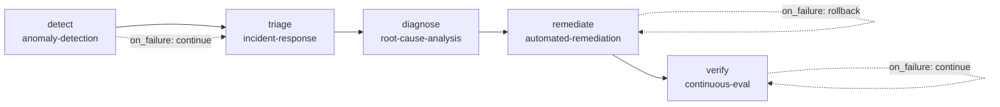

# Incident Pipeline Workflow

> **Part of:** [OMA Hub](../oma-hub.md)
> **Command**: `/oma:incident-pipeline`
> **Plugin**: `agenticops`
> **Lifecycle**: Day 2 — Operations

이 워크플로우는 프로덕션 인시던트를 자동으로 탐지·분류·진단·복구·검증하는 5단계 DAG입니다. 각 단계는 기존 agenticops 스킬에 매핑되며, 단계 간 데이터는 `.omao/state/` 파일 시스템을 통해 전달됩니다.

---

## Access Model

이 워크플로우는 **read-heavy + conditional-write + human-gated** 모드로 동작합니다.

- **CAN**: 메트릭/로그 조회, 인시던트 분류, RCA 분석, runbook 매칭, 복구 명령 draft
- **CANNOT (명시 승인 없이)**: SEV1 인시던트 자동 복구, 프로덕션 리소스 삭제
- **CANNOT**: SEV1 remediation 실행 (사람 전용), 안전 장치 우회

SEV2/3 복구는 `automated-remediation`의 preflight 검증을 통과한 경우에만 실행됩니다. SEV1은 진단까지만 자동화되고 remediation은 사람이 수행합니다.

---

## Required Context

파이프라인을 실행하기 전에 다음 정보가 확보되어야 합니다.

```
[ ] 1. 모니터링 대상 정의 — .omao/plans/observability/monitoring-targets.yaml
[ ] 2. 베이스라인 데이터 — 최소 7일 이상 메트릭 축적 (.omao/plans/observability/baselines/)
[ ] 3. 서비스 의존성 맵 — .omao/plans/observability/dependency-map.yaml
[ ] 4. Runbook 저장소 — .omao/plans/runbooks/ 에 1개 이상의 runbook 정의
[ ] 5. Golden dataset — .omao/plans/eval/golden/${target}.jsonl (최소 100 sample)
[ ] 6. MCP 서버 접근 — cloudwatch, prometheus MCP 정상 응답
[ ] 7. On-call 라우팅 — PagerDuty/Opsgenie 통합 설정 (SEV1 page용)
[ ] 8. 대상 서비스 배포 상태 — autopilot-deploy 상태 파일 존재
```

---

## Pre-flight Checks

모든 점검을 통과해야 파이프라인이 실행됩니다.

| # | Check | 조건 | Fail 시 조치 |
|---|-------|------|-------------|
| 1 | CloudWatch MCP 접근 | `mcp__cloudwatch` 응답 200 | MCP 서버 재시작 유도 |
| 2 | Prometheus MCP 접근 | `mcp__prometheus` 응답 200 | 연결 설정 확인 |
| 3 | 베이스라인 존재 | `.omao/plans/observability/baselines/` 에 1개 이상 파일 | anomaly-detection 단독 실행으로 베이스라인 생성 |
| 4 | Runbook 존재 | `.omao/plans/runbooks/*.yaml` 1개 이상 | runbook 미존재 시 remediate step은 skip |
| 5 | 활성 SEV1 없음 | `.omao/state/incident/sev1-*` 미해결 건 없음 | 기존 SEV1 해소 후 재실행 |
| 6 | Deploy freeze 아님 | `.omao/state/autopilot-deploy/freeze.json` 없음 | freeze 해제 후 재실행 |
| 7 | Golden dataset 존재 | verify step용 최소 100 sample | dataset 없으면 verify step skip |
| 8 | 이전 파이프라인 중복 | 동일 인시던트에 대한 진행 중 파이프라인 없음 | 기존 파이프라인 완료 대기 |

### Pre-flight Report

```
+-------------------------------+--------+---------------------+
| Check                         | Status | Details             |
+-------------------------------+--------+---------------------+
| 1. CloudWatch MCP reachable   |  P/F   |                     |
| 2. Prometheus MCP reachable   |  P/F   |                     |
| 3. Baselines exist            |  P/F   |                     |
| 4. Runbooks available         |  P/F   |                     |
| 5. No active SEV1             |  P/F   |                     |
| 6. No deploy freeze           |  P/F   |                     |
| 7. Golden dataset ready       |  P/F   |                     |
| 8. No duplicate pipeline      |  P/F   |                     |
+-------------------------------+--------+---------------------+
```

---

## DAG Structure



---

## Step Details

### Step 1: detect (anomaly-detection)

**목적**: 프로덕션 메트릭에서 이상 징후를 탐지하여 인시던트 파이프라인을 트리거합니다.

**실행 내용**:
- 모니터링 대상 메트릭 수집 (Prometheus + CloudWatch)
- 7일 이동 평균 + 3σ 기반 statistical baseline 비교
- 계절성 보정 및 다변량 상관관계 분석
- severity 분류 (Critical/Warning/Info)

**입력**: `.omao/plans/observability/monitoring-targets.yaml`
**출력**: `.omao/state/anomaly/${timestamp}-${metric}.json`

**on_failure: continue** — 탐지 실패는 "이상 없음"과 동일하게 처리합니다. 외부 알람(CloudWatch Alarm, Prometheus AlertManager)을 통해 직접 triage 단계로 진입할 수도 있으므로 detect 실패가 전체 파이프라인을 차단하면 안 됩니다.

---

### Step 2: triage (incident-response)

**목적**: 탐지된 anomaly 또는 수신된 알람을 인시던트로 공식화하고 severity를 분류합니다.

**실행 내용**:
- 알람 payload 파싱 및 severity 확정 (SEV1~4)
- Runbook 검색 (symptom 키워드 매칭)
- 3~5개 가설(hypothesis) 생성
- SEV1인 경우 on-call page + deploy freeze

**입력**: anomaly 이벤트 또는 외부 알람 ID
**출력**: `.omao/state/incident/${severity}-${timestamp}/`
- `hypotheses.json` — 가설 목록
- `timeline.jsonl` — 이벤트 타임라인

**on_failure: fail (default)** — severity 분류 실패 시 파이프라인을 중단합니다. 분류 없이 진행하면 SEV1 인시던트에 자동 복구가 실행될 위험이 있습니다.

### 🛑 CHECKPOINT — Triage Complete (SEV1 Gate)

SEV1로 분류된 경우 여기서 파이프라인의 자동 진행을 멈춥니다.

- **SEV1**: on-call page 후 사람 개입 대기. 에이전트는 diagnose까지만 보조하고 remediate/verify는 사람이 수행.
- **SEV2/3**: 자동 진행 가능. 아래 조건 확인 후 proceed.
- **SEV4**: 리포트만 생성하고 주간 리뷰 큐에 적재. 파이프라인 종료.

Before proceeding (SEV2/3 only):
- [ ] severity가 SEV2 또는 SEV3으로 확정됐는가
- [ ] 가설이 최소 1개 이상 생성됐는가
- [ ] deploy freeze가 적용됐는가 (SEV2의 경우)

---

### Step 3: diagnose (root-cause-analysis)

**목적**: 인시던트의 근본 원인을 체계적으로 식별합니다.

**실행 내용**:
- 인시던트 시점 ±30분 증거 자동 수집 (메트릭, 로그, K8s 이벤트, 변경 이력, CloudTrail)
- 타임라인 재구성 및 인과 관계 후보 식별
- Change-Incident 상관관계 분석 (시간 근접도 40% + 영향 범위 30% + 패턴 이력 30%)
- 의존성 그래프 탐색으로 blast radius 산정
- RCA 보고서 자동 생성

**입력**: `.omao/state/incident/${id}/hypotheses.json`
**출력**: `.omao/state/incident/${id}/rca-report.md`

**on_failure: fail (default)** — RCA 없이 복구를 진행하면 증상만 치료하고 재발합니다. 진단이 안 되면 사람이 개입해야 합니다.

---

### Step 4: remediate (automated-remediation)

**목적**: 알려진 장애 패턴에 대해 runbook 기반 자동 복구를 실행합니다.

**실행 내용**:
- RCA 결과 기반 runbook 매칭 (score ≥ 0.6)
- 7가지 preflight 검증 (SEV1 차단, retry 예산, cooldown 등)
- Runbook step 순차 실행 + 중간 검증
- 복구 전/후 메트릭 스냅샷 비교
- 실패 시 rollback 절차 실행

**입력**: `.omao/state/incident/${id}/rca-report.md` + `.omao/plans/runbooks/`
**출력**: `.omao/state/remediation/${incident-id}/${runbook-name}-${timestamp}.json`

**on_failure: rollback** — 복구 자체가 상황을 악화시킬 수 있으므로 실패 시 이전 상태로 되돌립니다.

**안전 장치**:
- SEV1은 절대 자동 복구하지 않음
- max_retries 초과 시 자동 에스컬레이션
- 동시 영향 Pod/서비스 수 상한 (기본 3)
- Human override (`/stop-remediation`) 즉시 중단

### 🛑 CHECKPOINT — Remediation Complete

Before proceeding to verify:
- [ ] remediation이 성공적으로 완료됐는가 (또는 rollback 후 안정됐는가)
- [ ] post-snapshot 메트릭이 pre-snapshot 대비 개선됐는가
- [ ] 에스컬레이션 없이 정상 종료됐는가

---

### Step 5: verify (continuous-eval)

**목적**: 복구 후 서비스 품질이 정상 범위로 복귀했는지 확인합니다.

**실행 내용**:
- Ragas 기반 5개 핵심 지표 평가 (faithfulness, answer relevance, context precision, toxicity, PII leakage)
- Baseline 대비 regression gate 판정 (5pp 하락 시 실패)
- 결과를 Prometheus에 push
- Gate 실패 시 별도 SEV3 인시던트 생성

**입력**: 복구 대상 서비스 + 버전
**출력**: `.omao/plans/eval/results/${target}-${timestamp}.json`

**on_failure: continue** — 검증 실패는 "복구 불완전"이지 "파이프라인 실패"가 아닙니다. 별도 인시던트로 전환되어 다음 파이프라인 사이클에서 처리됩니다.

---

## Data Flow Between Steps

```
detect                    triage                     diagnose
  │                         │                          │
  ├─ anomaly events ──────→ ├─ incident state ───────→ ├─ evidence collection
  │  (.omao/state/anomaly/) │  (.omao/state/incident/) │  (.omao/state/incident/
  │                         │  hypotheses.json         │   ${id}/evidence/)
  │                         │  timeline.jsonl          │  rca-report.md
  │                         │                          │
  │                         │                          ▼
  │                         │                     remediate
  │                         │                          │
  │                         │                          ├─ runbook match
  │                         │                          │  (.omao/plans/runbooks/)
  │                         │                          ├─ execution result
  │                         │                          │  (.omao/state/remediation/)
  │                         │                          │
  │                         │                          ▼
  │                         │                       verify
  │                         │                          │
  │                         │                          ├─ eval results
  │                         │                          │  (.omao/plans/eval/results/)
  │                         │                          └─ gate decision (pass/fail)
```

---

## Invocation

### 자동 트리거

- `anomaly-detection`의 5분 cron이 Critical anomaly를 탐지하면 자동으로 파이프라인 시작
- CloudWatch Alarm / Prometheus AlertManager 웹훅으로 triage 단계 직접 진입 가능

### 수동 트리거

```bash
oma run-workflow agenticops incident-pipeline
```

또는 채팅에서:
```
/oma:incident-pipeline
```

---

## Failure Modes & Escalation

| Step | 실패 시 동작 | 에스컬레이션 |
|------|-------------|-------------|
| detect | continue → triage로 넘어감 (외부 알람 대체) | 없음 |
| triage | fail → 파이프라인 중단 | 사람에게 알림 (severity 미확정) |
| diagnose | fail → 파이프라인 중단 | 사람에게 RCA 요청 |
| remediate | rollback → 이전 상태 복원 | escalation_on_failure severity로 에스컬레이션 |
| verify | continue → 별도 인시던트 생성 | SEV3 인시던트로 전환 |

---

## Validation Report

파이프라인 완료 후 전체 결과를 아래 형식으로 요약합니다.

```
+-------------------------------+--------+---------------------+
| Validation                    | Status | Details             |
+-------------------------------+--------+---------------------+
| Anomaly detected              |  P/F   | metric/severity     |
| Incident classified           |  P/F   | SEV level           |
| Root cause identified         |  P/F   | confidence score    |
| Remediation executed          |  P/F   | runbook name        |
| Recovery verified             |  P/F   | gate decision       |
| No SEV1 auto-remediation      |  P/F   | safety check        |
| Post-metrics within baseline  |  P/F   | metric comparisons  |
+-------------------------------+--------+---------------------+
| OVERALL                       |  P/F   | Resolved / Escalated|
+-------------------------------+--------+---------------------+
```

---

## 참고 자료

### 공식 문서

- [Amazon CloudWatch Anomaly Detection](https://docs.aws.amazon.com/AmazonCloudWatch/latest/monitoring/CloudWatch_Anomaly_Detection.html) — AWS 네이티브 이상 탐지
- [Prometheus AlertManager](https://prometheus.io/docs/alerting/latest/alertmanager/) — 알람 라우팅
- [Kubernetes Events API](https://kubernetes.io/docs/reference/kubernetes-api/cluster-resources/event-v1/) — 클러스터 이벤트
- [AWS CloudTrail](https://docs.aws.amazon.com/cloudtrail/latest/userguide/) — 변경 이력 추적
- [Ragas Documentation](https://docs.ragas.io/) — RAG 평가 메트릭

### 기술 블로그

- [Google SRE — Managing Incidents](https://sre.google/sre-book/managing-incidents/) — Incident command 원칙
- [Google SRE — Effective Troubleshooting](https://sre.google/sre-book/effective-troubleshooting/) — 체계적 진단 방법론
- [Netflix — RAD Outlier Detection](https://netflixtechblog.com/rad-outlier-detection-on-big-data-d6b0ff32fb44) — 대규모 시계열 이상 탐지

### 관련 스킬 (내부)

- [anomaly-detection](../../plugins/agenticops/skills/anomaly-detection/SKILL.md) — Step 1
- [incident-response](../../plugins/agenticops/skills/incident-response/SKILL.md) — Step 2
- [root-cause-analysis](../../plugins/agenticops/skills/root-cause-analysis/SKILL.md) — Step 3
- [automated-remediation](../../plugins/agenticops/skills/automated-remediation/SKILL.md) — Step 4
- [continuous-eval](../../plugins/agenticops/skills/continuous-eval/SKILL.md) — Step 5

### 관련 워크플로우 (내부)

- [Platform Bootstrap](./platform-bootstrap.md) — Day 0 인프라 구축 워크플로우
- [Self-Improving Deploy](./self-improving-deploy.md) — 피드백 루프 배포 워크플로우
- [OMA Hub](../oma-hub.md) — 중앙 라우팅 테이블
